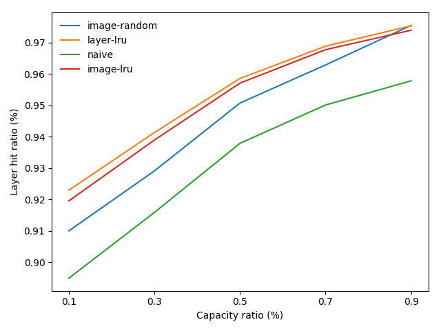
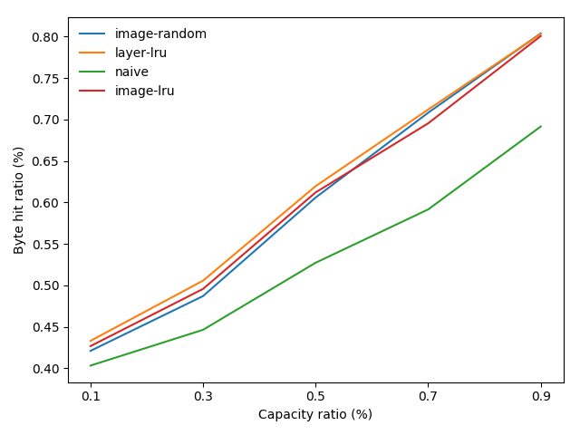
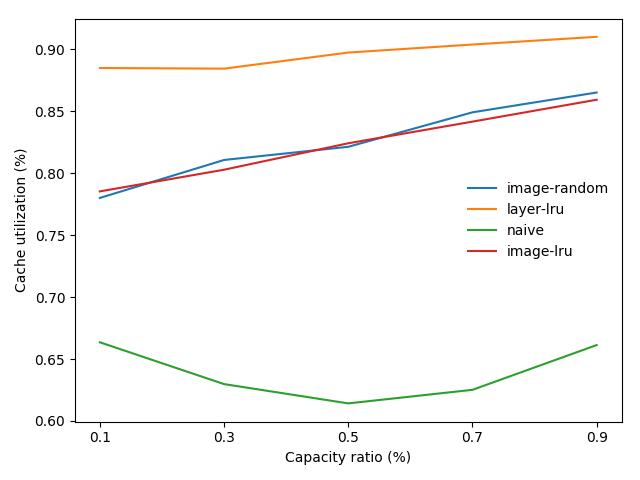
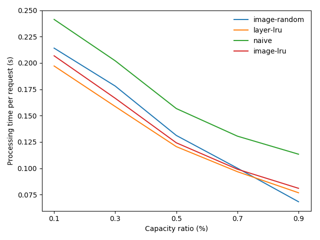
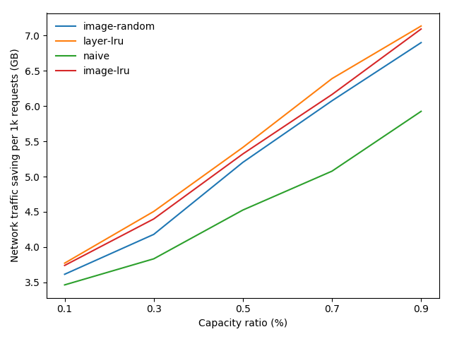

Docker Image Caching Basics and Baselines
=========================================

### 1. Image and layers
A Docker image is a read-only layered file system composed of layers stacked on top of each other. The layers are created during the image building process, each of which is created by an image buidling step (e.g., `RUN`, `COPY`) may or may not create data additional data to its previous step. The newly created data is the content of each layer, which is identified by a content-addressable identifier named `DiffID`. Specifically, when decompressing the compressed archive of a layer, the Docker engine redirects the byte stream to a *digester*, which generates the cryptographic digest (SHA256 by default) corresponding to the content as its `DiffID`. Hence, the `DiffID` uniquely identifies a layer with specific content. 

Since most layers have only partial data of a complete file system, they cannot be used individually but typically *chained* together as an *image* for use. Each layer in the chain is also uniquely identified by a `ChainID`, which is also a cryptographic digest generated based on the sequence of `DiffIDs` of layers in the chain. In other word, the `ChainID` uniquely identifes a layer chain by its content. The layer chain forms the root file system (i.e. `RootFS`) of an image. Note that the order of layers in the chain determines the `ChainID` - any change of the layer order will result a different `ChainID`. In Docker's layer subsystem, every layer is addressed by its associated `ChainID` instead of `DiffID`, and dangling layers are not allowed unless they are the bottom layer of a chain, in which case the `DiffID` is identical to the `ChainID` (a chain with only one layer). This design imposes limitations on operations upon individual layers. For instance, removing a layer amid a layer chain will invalidate `ChainID`s of layers on top and corrupt the layer chain, which is therefore probihited. Hence, we need to consider not only the target layer but also its predecessors and descendants in the layer chain when operating on every individual layer.

The layer operations are mostly executed by a so-called *graph driver*, which manages the layer data and metadata on the underlying file system. However, the graph driver is unaware of `DiffID` and `ChainID` but recognizes each layer by a unique, random digest named `CacheID`. 

To use an image for running a container, a read-write layer is created and stacked atop the layer chain of the image. Any write operation takes effect on the newly created read-write layer but will not impact the read-only layers beneath. 

### 2. Manage cache space for images and layers
As of writing, the latest version of Docker does not have any built-in cache management mechanism that automatically manages the cache space for images and layers, but burdens the users to manually delete unused/outdated images to spare space for new ones. However, it is impractical for users to eyeball unused/outdated images especially in a cluster setup (e.g., Kubernetes, Mesos, Docker Swarm). A common practice is to use the built-in `system prune` operation, which removes all the unused/outdated images, stopped containers and dangling volumes at once. The downside is that it will not retain any unused images, forcing recurring containers to download images repeatedly and thus causing delay for container start-up. Hence, it is intuitive to develop a cache management mechanism for the container runtime such as Docker. 

Intuitively, we can reserve a specific amount of space for caching popular images and adopt cache replacement policy to replace images in cache, aiming at avoiding redundant image downloads and accelerating container start-up. As a baseline, we use the *least-recent-used (LRU)* policy for image-level cache replacement considering its prevalence and effectiveness in many use cases. In addition, we also introduce a *random replacement* policy as a comparison, which randomly selects an image in cache for replacement when cache replacement is triggered. 

In addition, we also explore layer-level caching by introducing *layer-level LRU* since the finer granularity of caching unit may avoid unnecessary cache eviction and lead to improved cache performance. For instance, when a 10MB image added to a full cache and cache replacement triggered, layer-level can replace only several layers to spare 10MB space, instead of the entire 1GB image as image-level caching does. As a result, when the evicted image is needed again, only 10MB rather than 1GB of data needs to be downloaded and container start-up is therefore accelerated. 

### 3. Experimental setup 
The experimental environment consists of a Docker image registry where the images are hosted and Docker host (*puller*) that pulls images from the registry upon requests. Both hosts are VMs running in `us-east1-b` in Google Cloud Platform. In this experiment, we use the Docker registry trace dataset provided in the [Docker Registry Trace Player](http://research.cs.vt.edu/dssl/drtp-head.html) as the workload. Specifically, we use the first 40,000 image pulls collected from the Sydney data center to drive the experiment. 

Since the image repository and tag information is anonymized in the dataset, we have to synthesize images based on the information available in the trace such as layer size, order of layer download among others and push them to the Docker registry, in order to drive the real-world experiments. The details will be introduced in the main page of the project but omitted here. 

### 4. Results

As shown in the figures below, `naive` represents the method that clears cache by the `system prune` operation when cache replacement is triggered, while others are the baseline cache replacement policies introduced in Section 2. The *capacity ratio* is the ratio between the cache size and the total amount of image data to be pulled. 

#### 4.1 Layer hit ratio
As reflected in the figure, all the baselines achieve very high layer hit ratio (>90%) even when the cache space is relatively constrained. This is mainly due to the fact that the image popularity has a long-tail distribution as reported in the paper of [Anwar et al. (2018)](https://www.usenix.org/node/210501), wherein >90% and ~80% of image and layer accesses concentrate on the top 1% ranked images and layers, respectively. As a result, these frequent, repeated image pull requests inflate the cache ratio in overall. However, we still observe that the layer-level LRU (`layer-lru`) outpeforms others especially when the cache capacity is relatively constrained (0.1 to 0.5). The result is expected since the `layer-lru` tends to avoid unnecessary layer evictions during cache replacement, while others tend to overly evict layers as a part of an image being evicted. 

We also recognize that the difference in layer hit ratio between `image-lru` and `layer-lru` is small. This is intuitive since `layer-lru` resembles `image-lru` in behavior. When cache replacement is triggered, `layer-lru` will evict the least-recently used layers, which are likely parts of images being evicted by `image-lru`. The only opportunity where `layer-lru` outperforms `image-lru` is that some layers of the images evicted by `image-lru` can be partially retained and immediately requested by the next image pull, which is rare. Hence, the benefit of layer-level caching is marginal in this case.

#### 4.2 Byte hit ratio 
As expected, the byte hit ratio achieved by all the baselines incresaes as the cache capacity increases. `naive` results the worst byte hit ratio since it frequently purges the cache space during cache replacement. The `layer-lru` still achieves the highest byte hit ratio as compared to others mainly because of the extra layers it retains during cache replacement. However, due to the similar cache replacement behavior, its improvement over `image-lru` is trivial. Surprisingly, `image-random` is very competitive as compared to `layer-lru` and `image-lru`, and even surpassing `image-lru` when the cache capacity is relatively abundant (0.7 to 0.9). The intuition is that none of these baselines are aware of image or layer sizes and thus tend to make suboptimal cache replacement decisions leading to low byte hit ratio. Since high byte hit ratio indicates less network traffic for image downloads, it may be beneficial to factor image and layer size in cache replacement algorithm to improve the byte hit ratio.

#### 4.3 Cache utilization
The layer-level baseline attains the highest cache utilization as expected, outperforming the image-level counterpart by almost 10%. However, the significant improvement in cache utilization has not yet been converted into the par in layer and byte hit ratio, indicating that there are still opportunities to leverage the finer granularity of layer-level caching. 

#### 4.4 Absolute numbers
The `layer-lru` saves a rough total of 2,000 seconds in request processing time and up to 2GB network traffic for image download per 1,000 requests as compared to `naive`.

